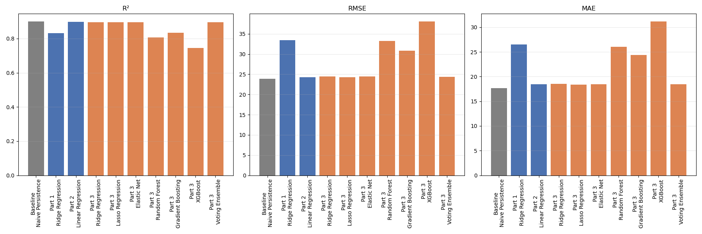
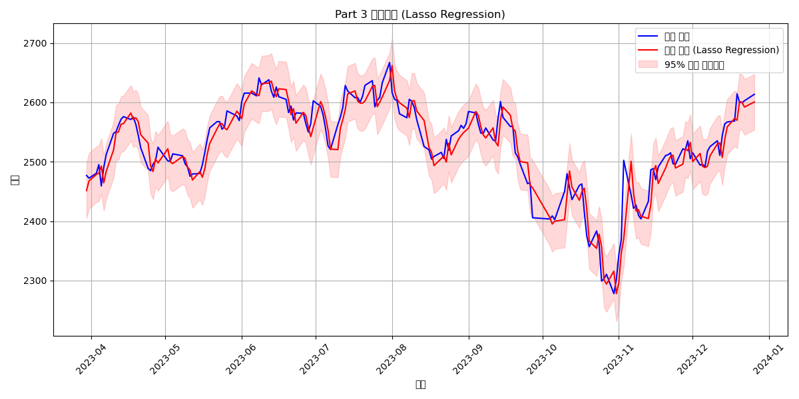
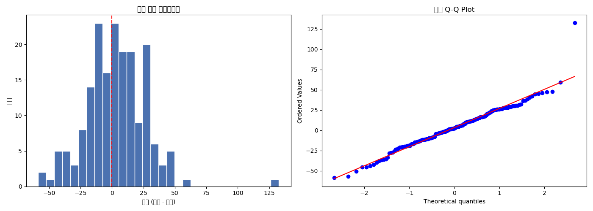

# KOSPI Index Prediction

Predicting the next trading day's KOSPI closing price with regression models,
built incrementally across three stages — from a bare-bones OHLCV baseline to
a tuned, ensembled model with proper time-series validation.

## Overview

- **Task**: predict tomorrow's KOSPI closing price from historical price/volume data
- **Data**: daily KOSPI OHLCV, 2019–2022 for training, 2023 held out for testing
- **Approach**: three stages of increasing model complexity, each validated
  with `TimeSeriesSplit` cross-validation to avoid leaking future information
  into training

## Key Insight

None of the nine trained models beat a trivial baseline that predicts
"tomorrow's close = today's close" (RMSE 23.86 vs. the best model's 24.23).
Daily closing price is close to a random walk, so a naive persistence
forecast already explains ~90% of the variance — a high R² on price *level*
is not, by itself, evidence that a model has learned anything useful. This
project treats that baseline as a required sanity check rather than an
afterthought, and reports it alongside every model.



## Results

| | Naive Baseline (Closeₜ₊₁ = Closeₜ) | Part 1 (OHLCV only) | Part 2 (+ Technical Indicators) | Part 3 (Tuned + Ensemble) |
|---|---|---|---|---|
| Best Model | — (persistence) | Ridge Regression | Linear Regression | Lasso Regression (tuned) |
| R² | 0.9002 | 0.8315 | 0.8971 | 0.8965 |
| RMSE | 23.86 | 33.41 | 24.23 | 24.30 |
| MAE | 17.64 | 26.51 | 18.22 | 18.39 |

**Part 1 → Part 2**: adding technical indicators lifted R² from 0.83 to
0.90 — a real, meaningful gain.

**Part 2 → Part 3**: adding more features (EMA/MACD, day-of-week, return
lags), hyperparameter tuning (`RandomizedSearchCV`), and a `VotingRegressor`
ensemble did *not* improve on Part 2's plain Linear Regression — the top
four models across Part 2/3 all land within R² 0.895–0.897. Most of Part
3's new features are highly correlated with what Part 2 already has (EMA
vs. MA, MACD derived from EMA, return lags vs. Daily Return), so they add
little new information. Walk-forward (expanding-window) validation confirms
the Part 3 model's performance is stable across 2023, not an artifact of
the single train/test split — it's a real, if modest, plateau.



## Methodology

**Part 1** — OHLCV lag features (1, 2, 3, 5 days) only.

**Part 2** — Part 1 + technical indicators: MA5/20/60, RSI, Bollinger
Bands, Momentum, Daily Return, Volatility.

**Part 3** — Part 2 + EMA12/26, MACD, day-of-week dummies, return lags (1,
2, 3 days), `RandomizedSearchCV` tuning, and a `VotingRegressor` ensemble of
the top 3 tuned models.

**Models compared**: Linear Regression, Ridge, Lasso, Elastic Net, Random
Forest, Gradient Boosting, XGBoost, plus a Voting ensemble in Part 3.

**Validation**:
- `TimeSeriesSplit` cross-validation for model selection (no data leakage)
- `RandomizedSearchCV` hyperparameter tuning within each CV fold (Part 3)
- Walk-forward (expanding-window) validation over the 2023 test period (Part 3)
- Residual-based 95% prediction interval (empirical coverage: 96.2%)
- Naive persistence baseline as a sanity check against every trained model



## Project Structure

```
machine_learning_hw1.ipynb   # full pipeline: data loading -> Part 1 -> Part 2 -> Part 3
README.md
data/
  kospi_train.csv             # not tracked in git, see below
  kospi_test.csv               # not tracked in git, see below
models/
  kospi_part{1,2,3}_model.pkl  # best model per part
  kospi_part{1,2,3}_scaler.pkl # matching StandardScaler per part
figures/
  *.png                        # correlation, predictions, residuals, comparisons
```

## Running It

1. Place `kospi_train.csv` and `kospi_test.csv` (daily `Date, Open, Low,
   High, Close, Volume`) under `data/` — these aren't committed to git.
2. Install dependencies: `pandas`, `numpy`, `matplotlib`, `seaborn`,
   `scikit-learn`, `xgboost`, `scipy`, `joblib`.
3. Run `machine_learning_hw1.ipynb` top to bottom. Models/scalers are saved
   to `models/` and plots to `figures/`.

## Tech

Python, scikit-learn, XGBoost, pandas, NumPy, Matplotlib, seaborn
