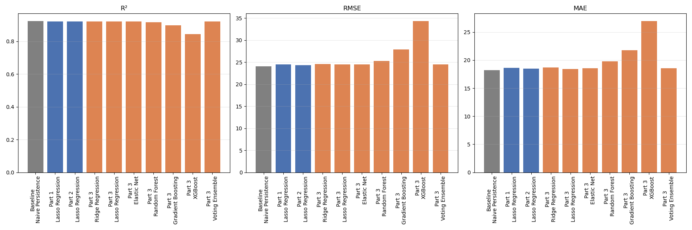
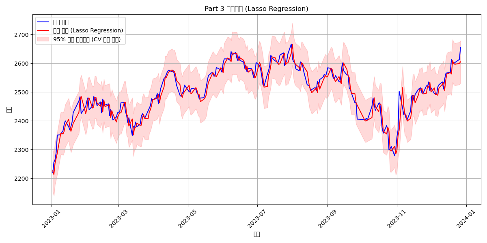
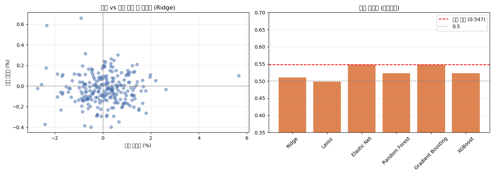
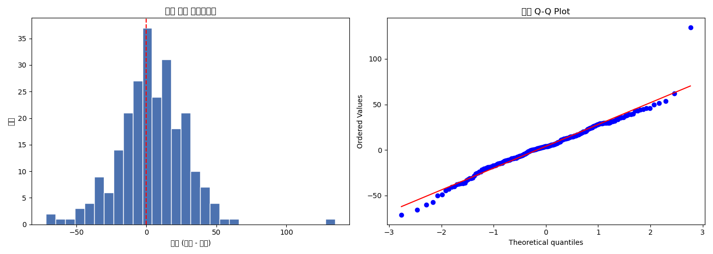

# KOSPI Index Prediction

[](https://github.com/0se0/hw1/actions/workflows/tests.yml)

Predicting the next trading day's KOSPI closing price with regression models,
built incrementally across four stages — from a bare OHLCV feature set, to a
tuned and ensembled model, to finally reframing the problem from predicting the
price level to predicting the next-day return.

## TL;DR

- Built a leakage-free, comparable evaluation setup for next-day KOSPI prediction:
  model selection by time-series CV only, identical train/test rows for every
  stage, and naive baselines next to every model.
- Under that setup, a price-level R² of ~0.92 is what "tomorrow = today" already
  achieves; tuning, ensembling, and extra indicators do not improve on it.
- Reframed as return prediction, no model beat a zero forecast or an "always up"
  guess on direction — with these features and 243 test days, no signal was detectable.

## Skills Demonstrated

- **Time-series ML validation**: `TimeSeriesSplit` CV, walk-forward (expanding-window)
  evaluation, leakage detection and removal
- **Feature engineering**: lag features, technical indicators (MA/EMA, RSI, MACD,
  Bollinger), stationary return features
- **Modeling**: linear (Ridge/Lasso/Elastic Net) and tree-based models (Random Forest,
  Gradient Boosting, XGBoost), `RandomizedSearchCV` tuning, `VotingRegressor` ensembling
- **Evaluation rigor**: naive/zero/always-up baselines, out-of-sample R², rank IC,
  binomial significance test, prediction intervals
- **ML engineering**: modular `src/` package, unit tests that guard against look-ahead
  and train/test leakage, CLI for retraining and inference, GitHub Actions CI
- **Tooling**: Python, scikit-learn, XGBoost, pandas, NumPy, SciPy, Matplotlib, seaborn, pytest

## Overview

- **Task**: predict tomorrow's KOSPI closing price from historical price/volume data
- **Data**: daily KOSPI OHLCV, 2019–2022 for training (926 usable rows), 2023 held out for testing (243 rows)
- **Approach**: four stages of increasing rigor. Models are selected by
  `TimeSeriesSplit` cross-validation on the training data only; the 2023 test set is
  used for the final report, never for choosing a model.
- **Comparable by construction**: every part and the baseline are evaluated on the
  exact same train/test rows, and rolling indicators are computed over the full
  history using past values only (no look-ahead).

## Key Insight

None of the models selected by cross-validation beats a trivial baseline that
predicts "tomorrow's close = today's close" (test RMSE 24.09 vs. 24.35–24.55).
Daily closing price is close to a random walk, so a persistence forecast already
explains ~92% of the variance — a high R² on price *level* is not, by itself,
evidence that a model has learned anything useful. This project reports the
baseline next to every model as a required sanity check.

Two things the baseline made visible:

- **Information parity matters.** An earlier version of this pipeline left out the
  current day's OHLCV (predicting `t+1` from `t-1` and earlier), which made the
  models look much worse than the baseline (R² 0.83) and made technical indicators
  look like a big win. Once the same information the baseline uses (day `t`) is
  included, plain linear models land on top of the baseline.
- **Feature engineering barely moves the needle.** Adding technical indicators
  (Part 2) changes test R² by about +0.001, and the extra features, tuning, and
  ensembling in Part 3 do not improve on it.
- **The honest test is return prediction.** Predicting the next-day *return*
  (Part 4) removes the random-walk shortcut. There, no model beats a zero or
  mean forecast, and none predicts direction better than always guessing "up".
  With price/volume-derived daily features and this test size, no signal is
  detectable.



## Results

Test set (2023, 243 rows). Each part's model is the one with the lowest
`TimeSeriesSplit` CV MSE; all three happen to be Lasso.

| | Naive Baseline (Closeₜ₊₁ = Closeₜ) | Part 1 (OHLCV) | Part 2 (+ Technical Indicators) | Part 3 (+ Extra Features, Tuned) |
|---|---|---|---|---|
| Selected Model | — (persistence) | Lasso | Lasso | Lasso (tuned) |
| R² | 0.9235 | 0.9209 | 0.9219 | 0.9206 |
| RMSE | 24.09 | 24.49 | 24.35 | 24.55 |
| MAE | 18.20 | 18.60 | 18.46 | 18.44 |

- All CV-selected models trail the baseline by ~1–2% RMSE.
- A few *non-selected* linear models edge past it on the test set (Part 2 Ridge
  RMSE 23.94, Part 2 Linear 24.05), but by well under 1% — noise-level differences,
  and picking them would mean selecting on the test set.
- Part 3's `VotingRegressor` ensemble (R² 0.9209) does not beat its best member.
  Most of Part 3's new features are nearly redundant with Part 2's (e.g. EMA12 vs.
  MA5 correlation 0.998, EMA26 vs. MA20 0.999; MACD is derived from the EMAs).
- Walk-forward (expanding-window) validation of the Part 3 model gives R² 0.9217 /
  RMSE 24.37 — consistent with the single split, and still a hair behind the baseline.
- Tree models (Random Forest, Gradient Boosting, XGBoost) do notably worse than
  linear models here (likely because they cannot extrapolate beyond the price range
  seen in training; not tested separately).



### Part 4 — next-day return

Same train/test rows, stationary features only (returns and lags, gaps to moving
averages, volatility, volume ratio, RSI, MACD/close, Bollinger %B, day-of-week).
Out-of-sample R² is measured against a zero forecast (positive = better than
predicting no change).

| | CV MSE (1e-4) | Test RMSE (%) | OOS R² vs zero | Direction acc. | Spearman IC |
|---|---|---|---|---|---|
| Zero forecast (= price baseline) | 1.829 | 0.979 | 0.000 | — | — |
| Train-mean forecast | 1.835 | 0.979 | +0.002 | — | — |
| Always "up" | — | — | — | 0.547 | — |
| Ridge (CV-selected) | 1.821 | 0.994 | −0.031 | 0.510 | +0.019 |
| Lasso | 1.832 | 0.983 | −0.008 | 0.498 | +0.009 |
| Random Forest | 1.838 | 0.991 | −0.024 | 0.523 | −0.033 |
| Gradient Boosting | 1.837 | 0.979 | +0.000 | 0.547 | — |
| XGBoost | 1.831 | 0.983 | −0.008 | 0.523 | −0.037 |

- The CV-selected Ridge beats the zero forecast in CV by only 0.4% and then does
  worse on the test set (OOS R² −0.031); converted back to price, its RMSE is
  24.47 vs. 24.09 for the naive baseline.
- Elastic Net and Gradient Boosting shrink to a constant forecast (they find no
  signal), so their direction accuracy simply equals "always up".
- No model's direction accuracy beats "always up" (one-sided binomial test,
  p ≥ 0.5 for all; the best information coefficient is +0.019).
- With 243 test points the standard error on direction accuracy is about 3
  percentage points, so a small real edge could not be detected — but nothing here
  suggests one. This is consistent with next-day returns being close to
  unpredictable from past prices and volume alone.



## Methodology

**Part 1** — OHLCV for the current day and lags of 1, 2, 3, 5 days.

**Part 2** — Part 1 + technical indicators: MA5/20/60, RSI, Bollinger Bands,
Momentum, Daily Return, Volatility, consecutive up/down-day counts.

**Part 3** — Part 2 + EMA12/26, MACD and signal line, day-of-week dummies, return
lags (1, 2, 3 days), `RandomizedSearchCV` tuning, and a `VotingRegressor` ensemble
of the top 3 tuned models.

**Part 4** — Target changes to the next-day return `Close(t+1)/Close(t) − 1`.
21 stationary features, `RandomizedSearchCV` per model with ranges rescaled to
return magnitudes, compared against zero, mean, and always-up baselines.

**Models compared**: Linear Regression, Ridge, Lasso, Elastic Net, Random Forest,
Gradient Boosting, XGBoost, plus a Voting ensemble in Part 3 (Part 4: the six
tuned models above).

**Validation**:
- Model selection by `TimeSeriesSplit` cross-validation MSE (training data only)
- `RandomizedSearchCV` hyperparameter tuning with `TimeSeriesSplit` as the CV scheme (Part 3)
- Identical train/test rows for every part and the baseline
- Naive persistence baseline as a sanity check against every model
- Part 4: out-of-sample R² against a zero forecast, direction accuracy against an
  always-up baseline with a one-sided binomial test, and rank correlation (IC)
- Walk-forward (expanding-window) validation over the 2023 test period (Part 3)
- Approximate 95% prediction interval sized from out-of-sample CV residuals on the
  training data (half-width ±73.7). It covers 99.6% of the test points, i.e. it is
  conservative: early CV folds train on little data and inflate the residual spread.



## Next Steps

- **Information the model doesn't have**: USD/KRW, overnight US index returns,
  interest rates, and foreign-investor flows — daily KOSPI price/volume alone
  appears to be exhausted.
- **More test data**: a multi-year walk-forward evaluation, since 243 days cannot
  detect an edge of a few percentage points in direction accuracy.
- **Reframe the target**: up/down classification with calibrated probabilities and a
  cost-aware backtest, or volatility forecasting, which is generally more
  predictable than returns.

## Project Structure

```
machine_learning_hw1.ipynb   # narrative + results: Part 1 -> 2 -> 3 -> 4 (logic imported from src/)
src/
  data.py                    # CSV loading
  features.py                # feature construction, shared train/test split (no look-ahead)
  evaluation.py              # scaling, CV, walk-forward, return metrics, prediction intervals
  models.py                  # model sets, search spaces, CV-based selection
  train.py                   # CLI: retrain a part and save the CV-selected model
  predict.py                 # CLI: next-day prediction from a price history CSV
tests/                       # leakage / alignment / inference-consistency tests (synthetic data)
.github/workflows/tests.yml  # CI: runs the tests on every push
README.md
requirements.txt
data/
  kospi_train.csv             # not tracked in git, see below
  kospi_test.csv               # not tracked in git, see below
models/
  kospi_part{1,2,3,4}_model.pkl  # CV-selected model per part
  kospi_part{1,2,3,4}_scaler.pkl # matching StandardScaler per part
figures/
  *.png                        # correlation, predictions, residuals, comparisons
```

## Running It

1. Place `kospi_train.csv` (2019–2022) and `kospi_test.csv` (2023) under `data/`.
   These are daily KOSPI index files with columns `Date, Open, Low, High, Close,
   Volume`, provided as coursework data; they are not redistributed in this repo.
2. Install dependencies: `pip install -r requirements.txt`
   (developed and tested with Python 3.13, pandas 2.3, scikit-learn 1.7, xgboost 3.3).
3. Run `machine_learning_hw1.ipynb` top to bottom (or headless:
   `jupyter nbconvert --to notebook --execute --inplace machine_learning_hw1.ipynb`).
   Models/scalers are saved to `models/` and plots to `figures/`.

Outside the notebook:

```bash
python -m pytest -q                                    # run the tests (no data needed)
python -m src.train --part 2                           # retrain a part (1-4), saves to models/
python -m src.predict --part 2 --history data/kospi_test.csv   # predict from the latest row
```

`src.train` reproduces the notebook's saved models exactly (same CV selection and seeds).
`src.predict` needs about 60 trading days of history so the rolling indicators are defined;
parts 1–3 output the next close, part 4 the next-day return.

## Tech

Python, scikit-learn, XGBoost, pandas, NumPy, Matplotlib, seaborn
